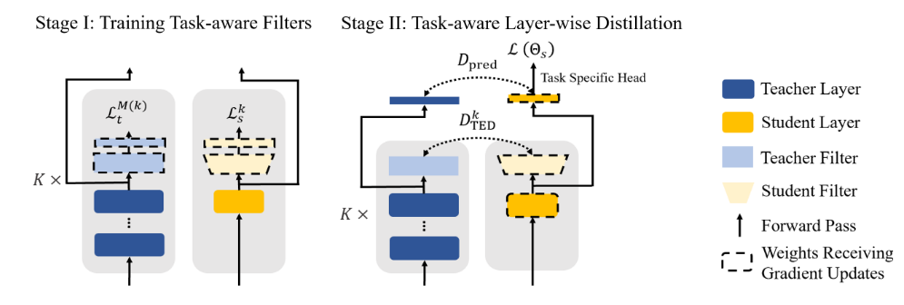

This knowledge distilation experiment adopted the method TED(Task rElated Distillation) introduced in [Less is More: Task-aware Layer-wise Distillation for Language Model Compression](https://arxiv.org/pdf/2210.01351) to distil from Deberta-v3-base to Debertav3-xsmall. 
### Hardware Specifications
- **CPU Cores**: 16
- **Memory**: 120 GB
- **GPU**: NVIDIA RTX 4090/24GB
- **Number of GPUs**: 1
- **OS/Platform**: Linux

### Third-Party Software
- **Python**: 3.12
- **PyTorch**: 2.3.0+cu121
- **CUDA**: 12.1

### NLU task distillation
#### Preparation：Finetuning teacher and student
```bash
./scripts/ft_v2.sh
```
#### Stage l: train filters
```bash
./scripts/train_filters.sh
```
#### Stage ll: task-related distillation
```bash
./scripts/ted_qa.sh
```

To run baselines:
```bash
./scripts/kd_qa.sh
./scripts/lwd_qa.sh
```
### Method description

In order to learn the pattern of teacher's hidden states, TED selects K layers of the teacher and equips each of them with a filter(K is the number of layers of the students). Each filter is a neural network with a task-specific head (e.g., a linear soft-max layer for classification). It takes in the hidden representation generated by this layer and outputs a prediction for the target task. In stage l, only filters of both models are trained on a specific task. Then in stage ll, the task-related heads in filters are removed and the MSE loss of all pairs of filter outputs is computed to measure the discrepancy between the filtered representations of the teacher and the student.

The training objective is 
```math
\min_{\Theta_s,\mathcal{W}_s} \mathcal{L}(\Theta_s)+\alpha_1 \mathcal{D}_{pred}(\Theta_t,\Theta_s)+\alpha_2 \mathcal{D}_{TED}([\Theta_t,\mathcal{W}_t],[\Theta_s,\mathcal{W}_s])
```
where $\Theta_s,W_s$ represent the backbone and filter parameters of the student model, respectively, while  $\Theta_t,W_t$  denote the corresponding parameters of the teacher model. $L(\Theta_s)$ is the target task loss, e.g. cross entropy loss in classification tasks. $D_{pred}(\Theta_t,\Theta_s)$ is the distillation loss, a distance metric between the output predictions of the teacher and the student. The last term denotes the following loss: 
```math
\mathcal{D}_{TED}([\Theta_t,\mathcal{W}_t],[\Theta_s,\mathcal{W}_s]) = \sum_{k=1}^{K}MSE \Bigl(g_t^k(H_t^{M(k)};W_t^k),g_s^k(H_s^k;W_s^k)\Bigr)
```
where $g_t^k(\cdot ;W_t^k)$  represents the filter of the kth layer, $W_t^k$ denotes filter parameters. $H_t^{M(k)}$ is the hidden state of the M(k)th layer in the teacher model, M(k) maps the layer index k of the student to the corresponding teacher layer index. Specially, when $g_t^k(\cdot ;W_t^k)$ is the identical mapping and $g_s^k(H_s^k;W_s^k) = H_s^kW_s^k$ , the method reduces to layer-wise distillation.  

Here are some of the hyperparameter settings of baselines and TED: 

| Hyperparameters   | $\alpha_1$     | $\alpha_2$       | filter_output_dim_without_head |
| ---------------- | -------------- | ---------------- | ------------------------------ |
| KD<br>LWD<br>TED | 10<br>10<br>10 | 0<br>100<br>5000 | 768<br>768<br>768|                               |

The table below shows the training settings of the teacher and the student. These hyperparameters are shared across the finetune step, Stage l and Stage ll. 

| Hyperparameters  | DeBERTaV3-base | DeBERTaV3-xsmall |
| ---------------- | -------------- | ---------------- |
| lr               | 3e-5           | 5e-5             |
| batch_size       | 48             | 48               |
| weight_decay     | 0              | 0                |
| training epochs  | 3              | 3                |
| lr_scheduler     | linear         | linear           |
| AdamW_betas      | (0.9,0.98)     | (0.9,0.98)       |
| AdamW $\epsilon$ | 1e-6           | 1e-6             |
### Results
Due to resource constraints, this experiment is conducted exclusively on the SQuAD v2.0 dataset. 

| Method <br>                                | SQuAD v2.0<br>EM/F1                     |
| ------------------------------------------ | --------------------------------------- |
| $Teacher_{base}$                           | 85.4/88.3                               |
| $Finetune_{xs}$<br>$KD_{xs}$<br>$LWD_{xs}$ | 80.4/83.4<br>82.6/85.4<br>82.8/85.7<br> |
| $TED_{xs}$                                 | 82.3/85.2                               |

According to this result, all distillation methods achieve an improvement of approximately two points in both EM and F1 scores compared to the finetuned XS model. Notably, TED, despite being the most complex method to implement, performs the worst under the current experimental settings.

